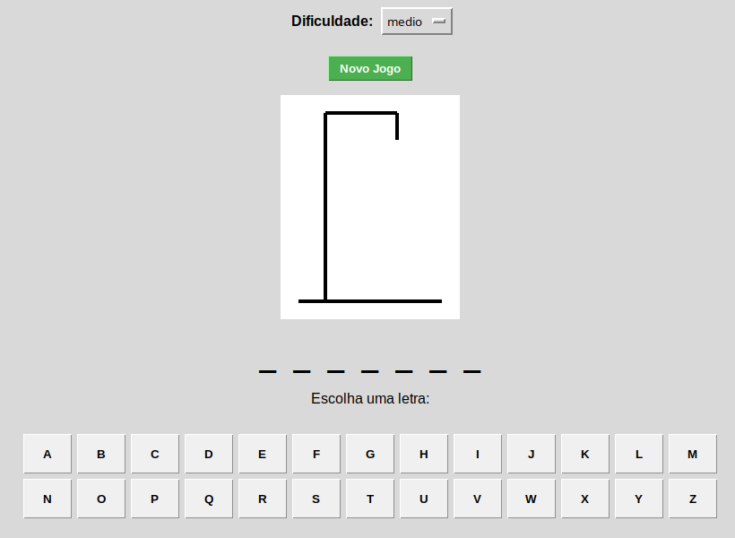

# 🕹️ Jogo da Forca em Python

Um jogo da forca clássico desenvolvido com **Python** e **Tkinter**. O projeto utiliza arquitetura MVC (Model-View-Controller) para separar a lógica do jogo da interface gráfica.

## 📸 Screenshots

<div align ="center">
  
</div>

## 🚀 Funcionalidades

- **3 Níveis de Dificuldade:** Fácil, Médio e Difícil (com bancos de palavras diferentes).
- **Interface Gráfica:** Desenvolvida com Tkinter nativo (sem necessidade de instalações complexas).
- **Sistema de Tentativas:** Visualização gráfica do boneco sendo desenhado a cada erro.
- **Teclado Virtual:** Desabilita letras já usadas para facilitar a jogabilidade.

## 🛠️ Tecnologias Utilizadas

- Python 3.x
- Tkinter (Interface Gráfica)
- Random (Lógica de sorteio)

## 📦 Como rodar este projeto

Certifique-se de ter o Python instalado.

1. Clone o repositório:
   ```bash
   git clone [https://github.com/DaviAfons/jogo-da-forca-python.git](https://github.com/DaviAfons/jogo-da-forca-python.git)


2.  Entre na pasta:

    ```bash
    cd NOME-DO-REPO
    ```

3.  Execute o jogo:

    ```bash
    python main.py
    ```

    *(No Linux, pode ser necessário instalar o `python3-tk` caso não venha nativo)*

## 📝 Licença

Este projeto está sob a licença MIT. Sinta-se livre para usar e modificar.

## 💻 Desenvolvido por:

**Davi Afonso**
